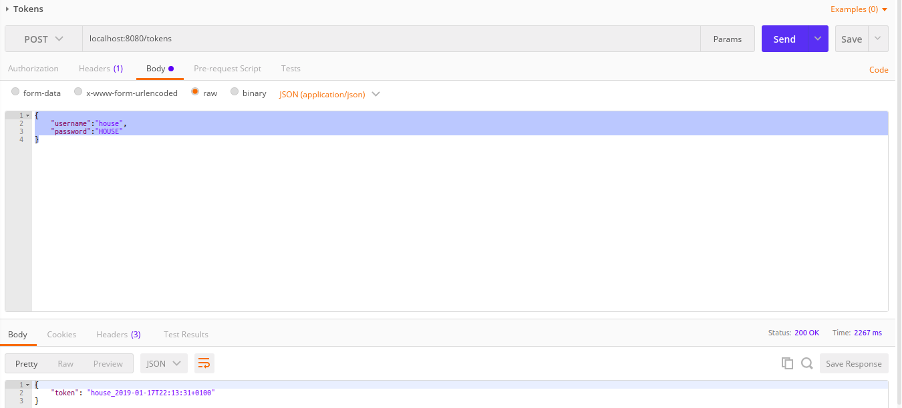
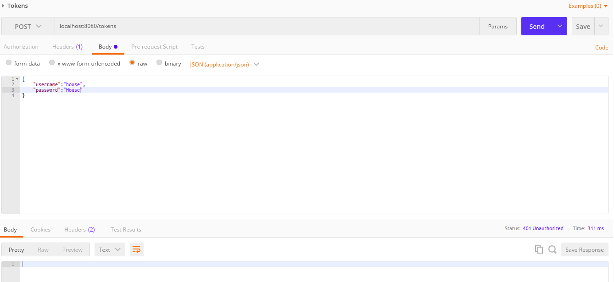
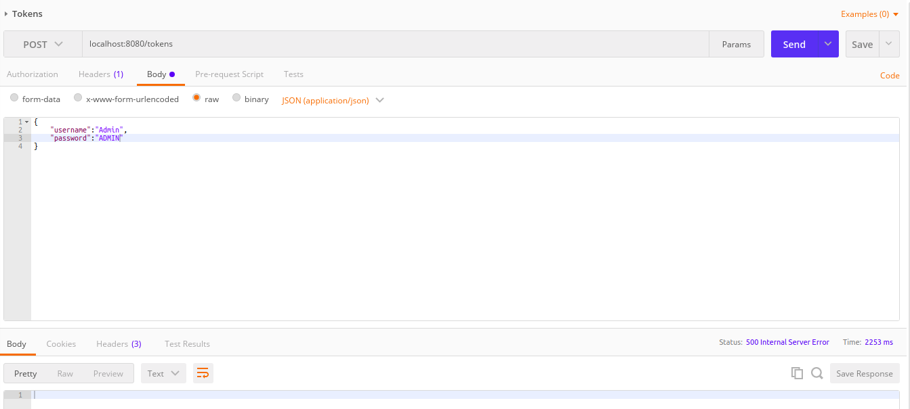

# Java 8 Backend Technical test solution

#### The solution has been designed and implemented following the next points:
* Applying TDD (on modules impl and interface)
* Using Mockito and Hamcrest (in some cases) for unit testing.
* Using Podam for unit testing. (Maybe not neccesary by now due to Dto Builders implemented) but is comfortable tool for testing .
* Using builder patterns for dto creations.
* Multimodular Spring Boot Project. Three modules and parent.
* Using spring core for Low level of coupling. Instance injection by constructor (avoiding autowired)
* Random Generator like utility to help generation token.
* Using Mockito callRealMethod method for test interface default methods.
* Using two kind of relevant exceptions for identify unauthorized request or fail generation.
* Using postman for test REST Api named generateToken.

#### Problems implementing default method
I have implemented the ISimpleAsyncTokenService overriding default method on implementation module.
The reason is the use of Validator and Generator inside the issueToken method without other interface methods
(authenticate and requestToken) implies coupling between impl (where are this two classes) and interface modules

One posibility would be locate this business logic on another module and add to impl and interface dependencies.
Maybe this implies over moduled project and not is an option on this exercise.

I have implemented the ISyncTokenService with authenticate and requestToken methods allowed on default method
for show that's best option to get an non coupling implementation of given interfaces.

#### Instructions

1) Open Intellij
2) Open project
3) Run main start class WebApplication on com.ciklum.configuration package, inside technical-test-web module.
4) Open Postman
5) Test on postman. Follow the next use cases and request construction.

#### Tests from Postman
1) Case Authentication and generation OK:

    * endpoint: localhost:8080/tokens
    * Method: POST
    * Header: Content-Type: application/json
    * Body: ``{"username":"house", "password":"HOUSE"}``

    

2) Case Authentication failed:

    * endpoint: localhost:8080/tokens
    * Method: POST
    * Header: Content-Type: application/json
    * Body: ``{"username":"house", "password":"House"}``

    

3) Case Token Generation failed:

    * endpoint: localhost:8080/tokens
    * Method: POST
    * Header: Content-Type: application/json
    * Body: ``{"username":"Admin", "password":"ADMIN"}``

    